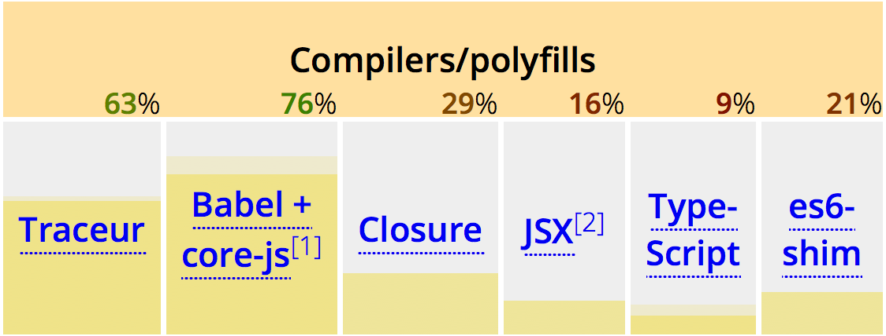

title: ECMAScript 2015
author:
  name: Jonathan Reyes
  twitter: jreyes33
  url: http://jreyes.org/es2015
output: index.html
style: styles/slides.css

--

# ECMAScript 2015
## The future of JavaScript, now

--

### The standard

> _**ECMA-262**  
> **6th Edition** / Draft March 17, 2015  
> Ecma/**TC39**/2015/0XX  
> **ECMAScript 2015**_

- Aligned with ISO/IEC 16262
- Current version is 5.1 (June 2011)
- Feature frozen in 2014
- To be published on June 18, 2015

--

### It's just waiting to be approved

--

### Other names and recent history

- ES Harmony (2008)
- ES.next (2011)
- ES6 (2011)
- ES 2015 (2015)

--

### Current support (browsers)

Source: [ECMAScript 6 compatibility table](https://kangax.github.io/compat-table/es6/)

--

### Current support (servers)

Source: [ECMAScript 6 compatibility table](https://kangax.github.io/compat-table/es6/)

--

### Current support (compilers)

Source: [ECMAScript 6 compatibility table](https://kangax.github.io/compat-table/es6/)

--

### How to use it now

--

### Additional resources

- [ES6 Learning (list of resources)](https://github.com/ericdouglas/ES6-Learning)
- [Axel Rauschmayer's articles](http://www.2ality.com/search/label/esnext)
- [_Understanding ECMAScript 6_ by Nicholas Zakas](https://leanpub.com/understandinges6)
- [Learn Harmony (interactive lessons)](http://learnharmony.org)

--

# Demo time

-- demo

<iframe src="demo.html"></iframe>

--

### Other features not in the demo

- Map, WeakMap, WeakSet
- Proxies and Reflect
- Modules
- Iterators
- API additions in Math, Number, String, Object

--

# Thanks

